# WellKenz Bakery ERP - Focused System Test Plan

**System:** WellKenz Bakery Enterprise Resource Planning System  
**Test Plan Version:** 2.0 (Focused)  
**Date:** November 30, 2025  
**Focus:** Core Process Flow Testing - Requisition → Purchasing → Inventory  

---

## 🎯 Executive Summary

This focused test plan concentrates on the **core business workflow** of the WellKenz Bakery ERP system, ensuring seamless integration between the main modules: **Requisition Management**, **Purchasing Operations**, and **Inventory Control**. The plan prioritizes end-to-end process validation while covering essential extras for comprehensive system testing.

### Primary Focus Areas:
1. **🧾 Requisition Process** - Employee requests to Supervisor approval
2. **🛒 Purchasing Workflow** - Purchase orders to supplier delivery  
3. **📦 Inventory Management** - Receiving to fulfillment operations
4. **🔄 End-to-End Integration** - Complete process flow validation

### Secondary Coverage:
- **👨‍💼 Supervisor Operations** - Approval workflows and oversight
- **⚙️ Admin Functions** - User management and system configuration
- **📊 Reports & Analytics** - Business intelligence and reporting

---

## 🔄 Core Process Flow Overview

### Main Workflow Diagram

```mermaid
graph TD
    A[👨‍🍳 Employee Creates Requisition] --> B[👨‍💼 Supervisor Reviews & Approves]
    B --> C{Stock Available?}
    C -->|Yes| D[📦 Inventory Fulfills Request]
    C -->|No| E[📝 Create Purchase Request]
    E --> F[🛒 Purchasing Creates PO]
    F --> G[🚚 Supplier Delivery]
    G --> H[📦 Inventory Receives Goods]
    H --> D
    D --> I[👨‍🍳 Employee Confirms Receipt]
    I --> J[✅ Process Complete]
    
    style A fill:#e1f5fe
    style B fill:#fff3e0
    style D fill:#e8f5e8
    style F fill:#f3e5f5
    style H fill:#e0f2f1
    style J fill:#c8e6c9
```

---

## 📋 Phase 1: Requisition Management Testing (Priority: HIGH)

### 1.1 Employee Requisition Creation Tests
- [ ] **T001:** Create requisition with single item
- [ ] **T002:** Create requisition with multiple items
- [ ] **T003:** Create requisition with different units of measurement
- [ ] **T004:** Submit requisition with future delivery date
- [ ] **T005:** Search and select items from inventory catalog
- [ ] **T006:** Add custom items not in catalog
- [ ] **T007:** Calculate estimated total cost
- [ ] **T008:** Save requisition as draft
- [ ] **T009:** Edit draft requisition before submission
- [ ] **T010:** Validate required fields before submission

### 1.2 Requisition Validation Tests
- [ ] **T011:** Submit requisition with negative quantities
- [ ] **T012:** Submit requisition with excessive quantities
- [ ] **T013:** Submit requisition without purpose justification
- [ ] **T014:** Submit requisition with invalid department
- [ ] **T015:** Test requisition number auto-generation
- [ ] **T016:** Validate date constraints (past/future dates)

### 1.3 Requisition Status Tracking Tests
- [ ] **T017:** View requisition status after creation
- [ ] **T018:** Track requisition through approval process
- [ ] **T019:** Receive notification of status changes
- [ ] **T020:** View requisition history and audit trail
- [ ] **T021:** Search requisitions by various criteria
- [ ] **T022:** Export requisition data

---

## 👨‍💼 Phase 2: Supervisor Approval Testing (Priority: HIGH)

### 2.1 Approval Workflow Tests
- [ ] **T023:** View pending requisitions in approval queue
- [ ] **T024:** Review requisition details and justifications
- [ ] **T025:** Approve requisition with adequate stock
- [ ] **T026:** Reject requisition with reason
- [ ] **T027:** Request modification to requisition
- [ ] **T028:** Bulk approve multiple requisitions
- [ ] **T029:** View approval statistics and metrics

### 2.2 Stock Analysis Tests
- [ ] **T030:** Review stock availability before approval
- [ ] **T031:** Identify requisitions requiring purchase orders
- [ ] **T032:** Analyze stock consumption patterns
- [ ] **T033:** Set minimum stock level alerts
- [ ] **T034:** Generate stock requirement reports

### 2.3 Approval Decision Impact Tests
- [ ] **T035:** Approved requisition triggers fulfillment workflow
- [ ] **T036:** Rejected requisition sends notification to employee
- [ ] **T037:** Modified requisition requires re-submission
- [ ] **T038:** Audit trail captures all approval actions

---

## 📦 Phase 3: Inventory Management Testing (Priority: HIGH)

### 3.1 Stock Level Monitoring Tests
- [ ] **T039:** View real-time stock levels
- [ ] **T040:** Check current stock availability for items
- [ ] **T041:** Monitor stock movement history
- [ ] **T042:** Generate stock level reports
- [ ] **T043:** Set up low stock alerts
- [ ] **T044:** Track batch-wise inventory

### 3.2 Fulfillment Process Tests
- [ ] **T045:** Process approved requisitions (FEFO method)
- [ ] **T046:** Select appropriate batches for fulfillment
- [ ] **T047:** Deduct stock quantities accurately
- [ ] **T048:** Handle partial fulfillment scenarios
- [ ] **T049:** Generate picking slips
- [ ] **T050:** Confirm item issuance to employees

### 3.3 Batch Management Tests
- [ ] **T051:** Create new batch records
- [ ] **T052:** Update batch quantities and costs
- [ ] **T053:** Track batch expiry dates
- [ ] **T054:** Generate batch labels
- [ ] **T055:** Search batches by item or batch number
- [ ] **T056:** Export batch information

### 3.4 Inbound Operations Tests
- [ ] **T057:** Receive delivery against purchase orders
- [ ] **T058:** Handle partial deliveries
- [ ] **T059:** Process quantity discrepancies
- [ ] **T060:** Create batch records during receiving
- [ ] **T061:** Update stock levels automatically
- [ ] **T062:** Generate receiving reports

---

## 🛒 Phase 4: Purchasing Operations Testing (Priority: HIGH)

### 4.1 Purchase Request to PO Workflow Tests
- [ ] **T063:** Convert requisition to purchase request
- [ ] **T064:** Create purchase order from approved requests
- [ ] **T065:** Link multiple requests to single PO
- [ ] **T066:** Add items manually to purchase order
- [ ] **T067:** Calculate PO totals and taxes
- [ ] **T068:** Select suppliers for PO items

### 4.2 Purchase Order Lifecycle Tests
- [ ] **T069:** Create draft purchase order
- [ ] **T070:** Submit PO for approval (if required)
- [ ] **T071:** Send PO to supplier
- [ ] **T072:** Track PO status updates
- [ ] **T073:** Handle PO modifications
- [ ] **T074:** Cancel PO if needed

### 4.3 Supplier Management Tests
- [ ] **T075:** Select supplier for each PO item
- [ ] **T076:** Apply supplier-specific pricing
- [ ] **T077:** Check supplier delivery performance
- [ ] **T078:** Manage supplier contact information
- [ ] **T079:** Track supplier payment terms

### 4.4 PO Integration Tests
- [ ] **T080:** PO triggers inventory receiving workflow
- [ ] **T081:** Received quantities update PO status
- [ ] **T082:** Partial receipts update PO accordingly
- [ ] **T083:** Completed POs archive properly

---

## 🔗 Phase 5: End-to-End Integration Testing (Priority: CRITICAL)

### 5.1 Complete Purchase-to-Pay Cycle Tests
- [ ] **T084:** Full workflow: Employee → Supervisor → Inventory → Purchasing → Supplier → Inventory → Employee
- [ ] **T085:** Validate data consistency across all modules
- [ ] **T086:** Verify notification flow between modules
- [ ] **T087:** Test concurrent users in different stages
- [ ] **T088:** Validate audit trail completeness
- [ ] **T089:** Test workflow interruption and resumption

### 5.2 Stock Movement Validation Tests
- [ ] **T090:** Track stock from PO receipt to requisition fulfillment
- [ ] **T091:** Verify batch continuity throughout process
- [ ] **T092:** Validate stock level calculations
- [ ] **T093:** Test stock reservation for approved requisitions
- [ ] **T094:** Handle stock adjustments during process

### 5.3 Financial Integration Tests
- [ ] **T095:** Calculate costs from supplier to employee
- [ ] **T096:** Track budget impact of requisitions
- [ ] **T097:** Generate cost analysis reports
- [ ] **T098:** Validate currency and decimal precision

---

## 🔧 Phase 6: Error Handling & Edge Cases (Priority: MEDIUM)

### 6.1 Exception Handling Tests
- [ ] **T099:** Handle insufficient stock scenarios
- [ ] **T100:** Manage supplier delivery delays
- [ ] **T101:** Process damaged goods and RTV
- [ ] **T102:** Handle user session timeouts
- [ ] **T103:** Manage database connection failures
- [ ] **T104:** Process duplicate requests

### 6.2 Data Validation Tests
- [ ] **T105:** Validate all input fields thoroughly
- [ ] **T106:** Test data type constraints
- [ ] **T107:** Verify foreign key relationships
- [ ] **T108:** Test unique constraint violations
- [ ] **T109:** Validate business rule constraints

### 6.3 Recovery Testing
- [ ] **T110:** Resume interrupted processes
- [ ] **T111:** Rollback failed transactions
- [ ] **T112:** Restore from system backups
- [ ] **T113:** Recover from network interruptions

---

## 👑 Phase 7: Admin & System Management (Priority: MEDIUM)

### 7.1 User Management Tests
- [ ] **T114:** Create and manage user accounts
- [ ] **T115:** Assign roles and permissions
- [ ] **T116:** Test role-based access control
- [ ] **T117:** Manage user status (active/inactive)
- [ ] **T118:** Reset user passwords
- [ ] **T119:** Audit user activities

### 7.2 Master Data Management Tests
- [ ] **T120:** Manage item catalog
- [ ] **T121:** Configure categories and units
- [ ] **T122:** Maintain supplier information
- [ ] **T123:** Set up system parameters
- [ ] **T124:** Import/export master data

### 7.3 System Configuration Tests
- [ ] **T125:** Configure notification settings
- [ ] **T126:** Set up approval workflows
- [ ] **T127:** Define business rules
- [ ] **T128:** Manage system integrations

---

## 📊 Phase 8: Reporting & Analytics (Priority: LOW)

### 8.1 Standard Reports Tests
- [ ] **T129:** Generate requisition reports
- [ ] **T130:** Create purchase order reports
- [ ] **T131:** Produce inventory reports
- [ ] **T132:** Generate supplier performance reports
- [ ] **T133:** Create stock movement reports

### 8.2 Analytics Tests
- [ ] **T134:** Analyze purchasing trends
- [ ] **T135:** Monitor inventory turnover
- [ ] **T136:** Track supplier performance metrics
- [ ] **T137:** Generate cost analysis
- [ ] **T138:** Create dashboard analytics

### 8.3 Export Functionality Tests
- [ ] **T139:** Export reports to PDF
- [ ] **T140:** Export data to Excel
- [ ] **T141:** Generate CSV exports
- [ ] **T142:** Schedule automated reports

---

## 🔔 Phase 9: Notification System (Priority: MEDIUM)

### 9.1 Notification Flow Tests
- [ ] **T143:** Real-time notifications for status changes
- [ ] **T144:** Email notifications for important events
- [ ] **T145:** Notification preferences management
- [ ] **T146:** Mark notifications as read/unread
- [ ] **T147:** Notification history tracking

### 9.2 Alert System Tests
- [ ] **T148:** Low stock alerts
- [ ] **T149:** Expiry date alerts
- [ ] **T150:** Overdue delivery alerts
- [ ] **T151:** Budget threshold alerts
- [ ] **T152:** System error alerts

---

## ⚡ Phase 10: Performance & Security Testing (Priority: LOW)

### 10.1 Performance Tests
- [ ] **T153:** Load testing with multiple concurrent users
- [ ] **T154:** Database query optimization
- [ ] **T155:** Report generation performance
- [ ] **T156:** File upload/download speeds
- [ ] **T157:** System response time validation

### 10.2 Security Tests
- [ ] **T158:** SQL injection protection
- [ ] **T159:** XSS vulnerability testing
- [ ] **T160:** CSRF protection validation
- [ ] **T161:** Session management security
- [ ] **T162:** Data encryption verification
- [ ] **T163:** Access control boundary testing

### 10.3 Compatibility Tests
- [ ] **T164:** Browser compatibility (Chrome, Firefox, Safari, Edge)
- [ ] **T165:** Mobile device responsiveness
- [ ] **T166:** Different screen resolutions
- [ ] **T167:** Print functionality testing

---

## 🧪 Testing Methodology

### Test Execution Sequence:
1. **Phase 1-2:** Core requisition and approval workflow (Foundation)
2. **Phase 3-4:** Inventory and purchasing operations (Business Logic)
3. **Phase 5:** End-to-end integration testing (System Validation)
4. **Phase 6-7:** Error handling and administration (Robustness)
5. **Phase 8-10:** Reporting, notifications, performance (Enhancement)

### Test Environment Setup:
- [ ] **Database:** Fresh test environment with sample data
- [ ] **Users:** Create test accounts for all roles
- [ ] **Suppliers:** Set up sample supplier records
- [ ] **Items:** Populate inventory with test items
- [ ] **Batches:** Create sample batch records

### Test Data Requirements:
- [ ] Minimum 50 test items across different categories
- [ ] 5-10 supplier records with complete information
- [ ] 20+ requisitions in various statuses
- [ ] 10+ purchase orders in different stages
- [ ] Batch records with various expiry dates

---

## ✅ Success Criteria

### Critical Path Requirements:
- [ ] **100% of Phase 1-2 tests must pass** (Requisition & Approval workflow)
- [ ] **95% of Phase 3-4 tests must pass** (Inventory & Purchasing)
- [ ] **100% of Phase 5 tests must pass** (End-to-end integration)
- [ ] **Zero critical defects** in core business processes
- [ ] **All user roles** can complete their primary workflows

### Performance Benchmarks:
- [ ] Page load times < 3 seconds
- [ ] Report generation < 10 seconds
- [ ] Database queries optimized (no N+1 problems)
- [ ] Support for 50+ concurrent users

### Data Integrity Requirements:
- [ ] Stock levels accurately reflect all transactions
- [ ] Financial calculations precise to peso-centavo level
- [ ] Audit trails complete and tamper-proof
- [ ] Data relationships maintained across modules

---

## 📈 Test Metrics & Reporting

### Daily Test Progress Tracking:
- **Tests Executed:** __/163
- **Tests Passed:** __
- **Tests Failed:** __
- **Success Rate:** __%

### Defect Tracking:
- **Critical:** __ (Must fix before deployment)
- **High:** __ (Fix within sprint)
- **Medium:** __ (Fix in next release)
- **Low:** __ (Enhancement candidates)

### Key Performance Indicators:
- **Process Cycle Time:** Average time from requisition to fulfillment
- **User Adoption Rate:** Percentage of users completing workflows
- **Error Rate:** Percentage of failed transactions
- **System Uptime:** Availability during testing period

---

## 🚀 Deployment Readiness Checklist

### Pre-Deployment Validation:
- [ ] All Phase 1-5 tests passed
- [ ] No critical or high-severity defects open
- [ ] Performance benchmarks met
- [ ] Security scan completed with no high-risk findings
- [ ] User acceptance testing completed
- [ ] Data migration validated
- [ ] Backup and recovery procedures tested
- [ ] Support team trained on system

### Go-Live Criteria:
- [ ] Executive approval obtained
- [ ] User training completed
- [ ] Support documentation ready
- [ ] Monitoring systems active
- [ ] Rollback plan prepared

---

## 📝 Next Steps

1. **Review and approve** this focused test plan
2. **Set up test environment** with proper isolation
3. **Execute Phase 1-2 tests** first (highest priority)
4. **Document results** in real-time using the checklist format
5. **Address critical defects** immediately
6. **Progress systematically** through remaining phases
7. **Validate readiness** before production deployment

---

*This focused test plan ensures comprehensive validation of the core WellKenz Bakery ERP business processes while maintaining efficiency and practicality. Priority is given to the main requisition-purchasing-inventory workflow that drives daily bakery operations.*