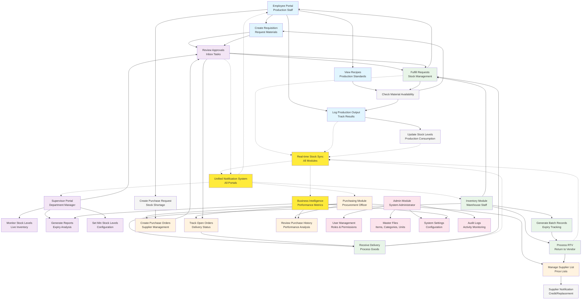
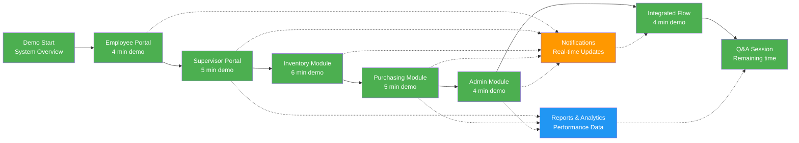

# WellKenz Bakery ERP - Visual System Flowchart



## Key Process Flows Explanation

### 1. **Material Requisition Cycle**
```
Employee → Request Materials → Supervisor → Inventory → Fulfillment → Employee Notification
```

### 2. **Purchase Order Process**
```
Stock Shortage → Purchase Request → PO Creation → Approval → Delivery → Stock Update
```

### 3. **Production Workflow**
```
Recipe Review → Material Check → Production → Output Logging → Stock Deduction
```

### 4. **Return to Vendor Process**
```
Quality Issue → RTV Processing → Supplier Notification → Resolution Tracking
```

### 5. **Real-time Synchronization**
All modules continuously sync data ensuring:
- Current stock levels across all interfaces
- Consistent approval statuses
- Updated batch information
- Real-time notifications

## Module Integration Points

### **Employee Portal Integration**
- ✅ Creates material requests
- ✅ Receives notifications
- ✅ Views production standards
- ✅ Logs production output
- ✅ Tracks request history

### **Supervisor Portal Integration**
- ✅ Approves requisitions & purchase requests
- ✅ Monitors real-time inventory levels
- ✅ Generates compliance reports
- ✅ Configures stock policies
- ✅ Reviews audit trails

### **Inventory Module Integration**
- ✅ Receives and processes deliveries
- ✅ Manages batch records with expiry dates
- ✅ Fulfills material requests
- ✅ Processes returns to vendor
- ✅ Maintains real-time stock accuracy

### **Purchasing Module Integration**
- ✅ Manages supplier relationships
- ✅ Creates and tracks purchase orders
- ✅ Handles procurement workflows
- ✅ Analyzes supplier performance
- ✅ Maintains pricing information

### **Admin Module Integration**
- ✅ Configures system settings
- ✅ Manages user access and permissions
- ✅ Maintains master data
- ✅ Monitors system performance
- ✅ Ensures compliance and security

## Demonstration Sequence Flowchart



## Key Features Highlight for Demo

### **Real-time Updates** 🔄
- Instant stock level synchronization
- Live approval status tracking
- Immediate notification delivery
- Cross-module data consistency

### **Batch Management** 📦
- Complete product lifecycle tracking
- Expiry date management
- Quality control documentation
- Supplier traceability

### **Role-based Security** 🔐
- Granular access control
- Audit trail maintenance
- Compliance-ready logging
- Secure approval workflows

### **Mobile-responsive Design** 📱
- Tablet-optimized interfaces
- Touch-friendly warehouse operations
- Cross-platform compatibility
- Responsive navigation

This visual flowchart provides a clear roadmap for your system demonstration, highlighting the interconnected nature of all modules and the seamless flow of information across the entire WellKenz Bakery ERP system.